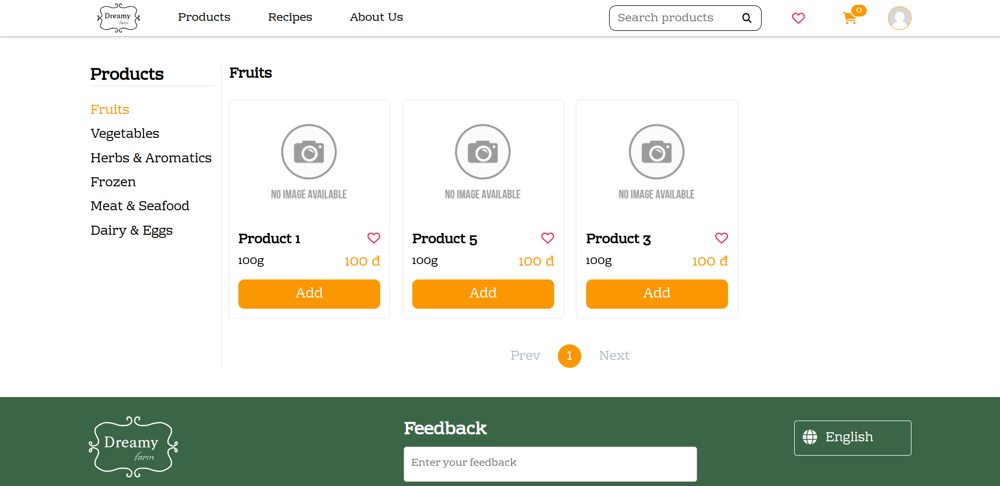
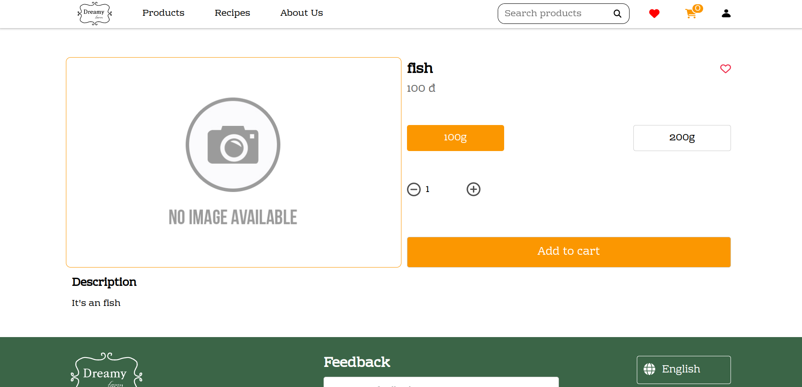

# The development branch of the dreamy farm website

## 1. Features

- **Searchbar**: search products and recipes (priority products) 5 results for
each time

- **Login, Register**: with password encryption

- **Feedback**: User cand send feedback to you

- **Two language**: Vietnamese and English

- **Pages**:

  - **Home page**: Introduce website

  - **Product page**: Show products in your db

  - **Recipe page**: Show recipes in your db

  - **About us**: Information about the company

  - **Wishlist page**: Show your favorite products

  - **Order page**: Show your old orders

  - **Address page**: Show your addreses

  - **Account information page**: To change your acount information

  - **Shopping cart page**: Show your products you choose to buy

  - **Checkout page**: Checkout before finsihed your order

  - **Product detail**: Show detail about product

  - **Recipe detail**: Show detail about recipe

## 2. Preview

<details>
  <summary>Show Images</summary>

  
  
  
  
  
  
  
  
  
  
  
  
  
  

</details>

## 3. How to run this project

- **Step 1. Install mongodb (because this project use local db)**

- **Step 2. Clone backend repo**

  ```
  git clone https://github.com/sontungexpt/dreamy-farm-server.git
  ```

- **Step 3. Run mongodb**

- **Step 4. Run the backend project first**

  **NOTE: Make sure installed all dependencies packages when pull from the remote if not run this command**

  ```
  npm install
  ```

  **Run project (Make sure you are in the root folder of the project)**

  ```
  npm start
  ```

- **Step 5. Run the frontend project**

  **NOTE: Make sure installed all dependencies packages when pull from the remote if not run this command**

  ```
  npm install
  ```

  **Run project (Make sure you are in the root folder of the project)**

  ```
  npm start
  ```


## 4. Authors

- **1. [Tran Vo Son Tung](https://github.com/sontungexpt)**
- **2. [Pham Nguyet Quynh](https://github.com/PhamNguyetQuynh)**
- **3. [Vo Nhu Phi](https://github.com/phifin)**
